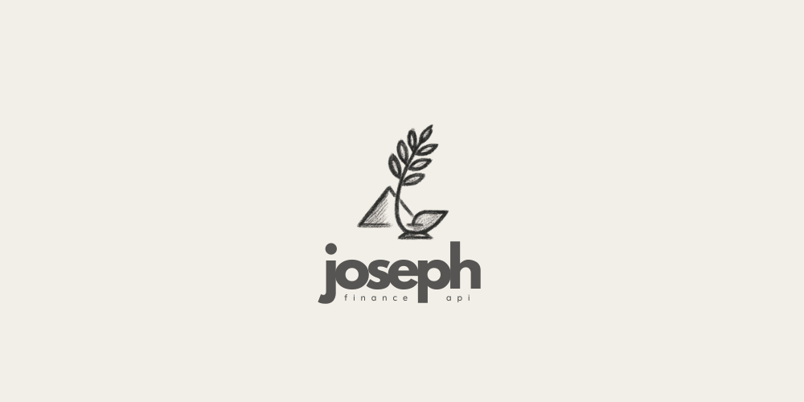

# 🧑‍💻 Joseph

## 📈 Sobre o projeto

Joseph é uma aplicação para cuidar de finanças pessoais, com foco em ações (bolsa de valores). O objetivo é ajudar no controle, análise e acompanhamento de investimentos.

<!--
<div align="center">
  
</div>
-->

## 🏺 Motivação do nome

O nome "Joseph" faz referência a José do Egito, personagem bíblico conhecido por sua sabedoria em administrar recursos e planejar para o futuro. Assim como José ajudou o Egito a se preparar para tempos de abundância e escassez, esta aplicação busca auxiliar no planejamento e gestão financeira.

## 🏗️ Arquitetura

O projeto adota a **Vertical Slice Architecture** (Arquitetura de Fatia Vertical).

Nesta abordagem, em vez de organizar o código por camadas técnicas (ex: `controllers`, `services`, `repositories`), nós o agrupamos por funcionalidade ou *feature*. Cada funcionalidade é uma "fatia" vertical que contém toda a lógica necessária, desde a API até o banco de dados. Por exemplo, toda a lógica relacionada ao cadastro de Ações (`Stock`) está contida no pacote `com.nazarethlabs.joseph.stock`.

Dentro de cada fatia, o código é organizado em 3 camadas principais:

- **Presentation (Apresentação):** Contém os `Controllers` que expõem a funcionalidade via API REST.
- **Application (Aplicação):** Contém os `Services` e `DTOs`, orquestrando a lógica de negócio da fatia.
- **Infrastructure (Infraestrutura):** Contém as `Entities` e `Repositories` que lidam com a persistência de dados.

Essa estrutura promove alta coesão e baixo acoplamento entre as funcionalidades, facilitando a manutenção e a evolução do sistema.

## 📋 Requisitos

- Java 21 ☕
- Gradle 🛠️
- Podman e Podman Compose 🐳

IDE recomendata: [Intelij IDEA](https://www.jetbrains.com/idea/download/?section=linux)

## 🚦 Como Executar o projeto

### 1. Iniciar o Banco de Dados

O projeto utiliza Podman Compose para gerenciar o container do banco de dados PostgreSQL, conforme definido no arquivo `podman-compose.yml`.

Para iniciar o banco de dados em background, execute na raiz do projeto:

```sh
podman-compose up -d
```

Para parar e remover o container, execute:

```sh
podman-compose down
```

### 2. Executar a Aplicação

Com o banco de dados em execução, você pode rodar a aplicação Spring Boot:

```sh
./gradlew bootRun
```

Para rodar em modo debug e conectar um depurador na porta `5005`:

```sh
./gradlew bootRun --debug-jvm
```

## 🦅 Database Migrations com Flyway

O projeto utiliza o Flyway para gerenciar a evolução do esquema do banco de dados. O Spring Boot está configurado para executar automaticamente as migrações pendentes sempre que a aplicação é iniciada.

### Como criar uma nova migração

Para adicionar uma nova alteração ao banco de dados, siga estes passos:

1.  Crie um novo arquivo SQL no diretório: `src/main/resources/db/migration`.
2.  O nome do arquivo **deve** seguir o padrão de nomenclatura do Flyway: `V<VERSAO>__<DESCRICAO_CURTA_EM_SNAKE_CASE>.sql`.

    -   `V<VERSAO>`: Começa com `V`, seguido pelo número da versão (ex: `V1`, `V2`, `V1.1`).
    -   `__`: Dois underscores separam a versão da descrição.
    -   `<DESCRICAO_CURTA_EM_SNAKE_CASE>.sql`: Uma breve descrição do que a migração faz, usando letras minúsculas e underscores no lugar de espaços.

**Exemplo prático (baseado na migração existente):**

-   **Nome do arquivo:** `V1__create_stock_table.sql`
-   **Conteúdo:**

    ```sql
    CREATE TABLE stocks (
        id UUID PRIMARY KEY,
        ticker VARCHAR(255) NOT NULL,
        company_name VARCHAR(255) NOT NULL,
        CONSTRAINT uk_ticker UNIQUE (ticker)
    );
    ```

Ao iniciar a aplicação, o Flyway detectará este novo arquivo, executará o script no banco de dados e registrará a migração na sua tabela de controle de esquema.

## 📜 Documentação da API (Swagger)

O projeto utiliza o Springdoc para gerar automaticamente a documentação da API no formato OpenAPI 3. Essa documentação é interativa e permite visualizar e testar todos os endpoints disponíveis diretamente pelo navegador.

> **Atenção:** Todos os endpoints da API e o Swagger estão protegidos por autenticação OAuth2 via GitHub. Para acessar, é necessário autenticar-se com sua conta do GitHub.

Com a aplicação em execução, você pode acessar a documentação através dos seguintes links:

- [Swagger UI (Interface Gráfica)](http://localhost:8080/docs)
- [Definição OpenAPI (JSON)](http://localhost:8080/api-docs)

## 🔐 Variáveis de Ambiente e Configurações Sensíveis

Este projeto utiliza variáveis de ambiente para armazenar informações sensíveis, como tokens de API e chaves secretas. **Nunca coloque valores sensíveis diretamente no arquivo `application.yml` versionado!**

### Como configurar

1. No arquivo `application.yml`, as configurações sensíveis são referenciadas assim:

```yaml
integration:
  brapi:
    base-url: https://brapi.dev/api
    token: ${BRAPI_TOKEN}
  resend:
    base-url: https://api.resend.com
    api-key: ${RESEND_API_KEY}
```

2. Antes de rodar a aplicação, defina as variáveis de ambiente no seu terminal ou na sua IDE. Por exemplo, no terminal Linux ou macOS, você pode fazer isso assim:

```sh
export BRAPI_TOKEN=seu_token_aqui
export RESEND_API_KEY=sua_api_key_aqui
```

3. Nunca faça commit de arquivos com dados sensíveis! Use sempre variáveis de ambiente ou arquivos ignorados pelo Git.

## 🧪 Testes Unitários

O projeto utiliza o JUnit 5 e o Mockito para testes unitários em Kotlin. Os testes estão localizados no diretório `src/test/kotlin`.

Para executar todos os testes unitários, utilize:

```sh
./gradlew test
```

Os relatórios de teste são gerados em `build/reports/tests/test/index.html`.

## 🎨 Qualidade de Código com Ktlint

O projeto utiliza o Ktlint para garantir um estilo de código consistente.
- `./gradlew ktlintCheck` — Verifica se o código está em conformidade com as regras.
- `./gradlew ktlintFormat` — Formata o código automaticamente para corrigir violações.

## 🚀 Versionamento, Release e Deploy (CI/CD)

O projeto utiliza um fluxo automatizado de CI/CD para garantir qualidade, versionamento semântico e deploy seguro. Veja como funciona cada etapa:

### a) Pull Request Validation (CI)
- **Quando roda:** Em todo push pull requests.
- **O que faz:**
  - Executa testes automatizados (unitários, integração, etc).
  - Roda linters (ktlint, etc).
  - Checa cobertura de testes.
  - (Opcional) Checa formatação/código estático.
- **Objetivo:** Garantir que nada é mergeado sem passar por todos os checks de qualidade e testes.

### b) Release Automation (semantic-release)
- **Quando roda:** Manualmente (workflow_dispatch).
- **O que faz:**
  - Analisa os commits seguindo Conventional Commits.
  - Gera/atualiza o `CHANGELOG.md` com base nos commits relevantes (feat, fix).
  - Cria uma nova tag de versão semântica.
  - Atualiza arquivos de versão (`build.gradle.kts`, `application.yml`, etc).
  - Abre um Pull Request automático com as alterações de changelog e versionamento.
  - Só gera release se houver commit relevante (`feat`, `fix`).
- **Objetivo:** Garantir versionamento semântico, changelog e versionamento de arquivos sempre corretos e auditáveis.

### c) Deploy
- **Quando roda:** Após o merge do PR de release (ou após a criação de uma nova tag/release na branch principal).
- **O que faz:**
  - Faz build do artefato final.
  - Publica/deploya para ambiente de staging/produção.
  - (Opcional) Notifica time, atualiza status, etc.
  - Health check: `/actuator/health`
- **Objetivo:** Garantir que só código validado, testado e versionado chegue ao ambiente de produção.

---

## 🤝 Como contribuir

1. Dev cria branch `feature/xxx`.
2. Abre Pull Request (PR) para `master`.
3. Workflow de PR valida código (testes, lint, etc). Só pode dar merge se **todos os checks passarem**.
4. Merge do PR na `master` dispara o workflow de release.
5. Se houver `feat`/`fix`, gera nova tag, changelog, atualiza arquivos de versão e abre PR automático com essas alterações.
6. Merge do PR automático de release.
7. (Opcional) Workflow de deploy é disparado após merge desse PR ou após a criação da nova tag. Deploya para produção/staging.

   > **Importante:** O Pull Request só será aceito se passar por todos os checks automáticos definidos no workflow `pr-checks.yml`.
   >
   > **Atenção:** A porcentagem mínima de cobertura de testes exigida pelo CI é **95%**.
   
Esse fluxo garante qualidade, rastreabilidade e entrega contínua de valor.

-----

## 📜 Licença

Este projeto está sob a licença MIT. Veja o arquivo [LICENSE.md](LICENSE.md) para mais detalhes.
